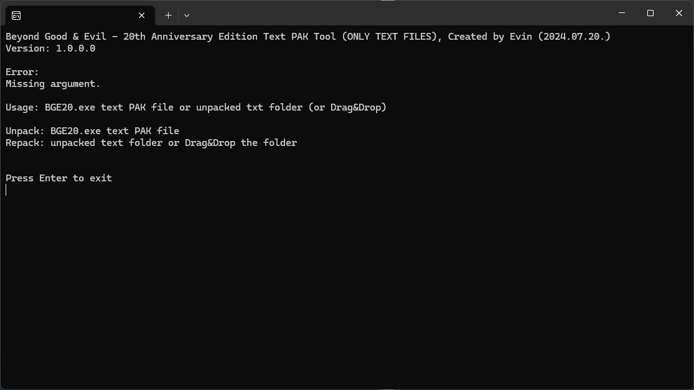
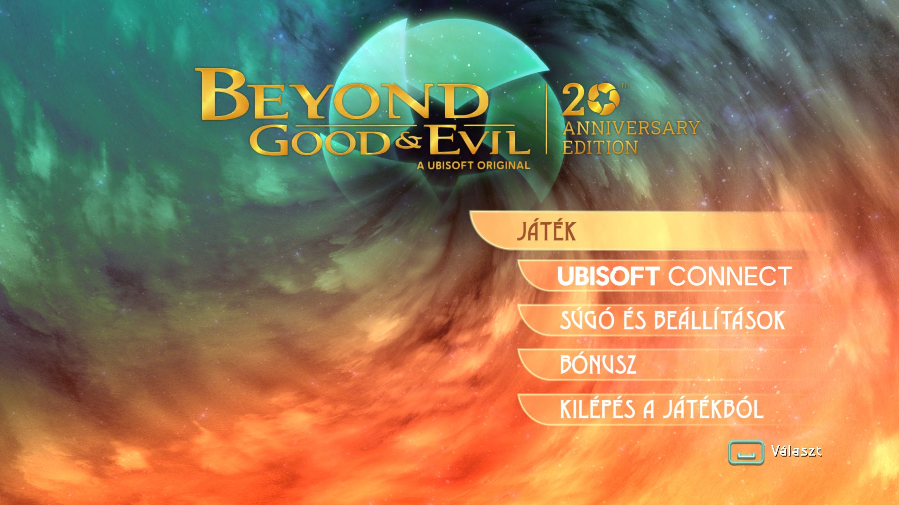
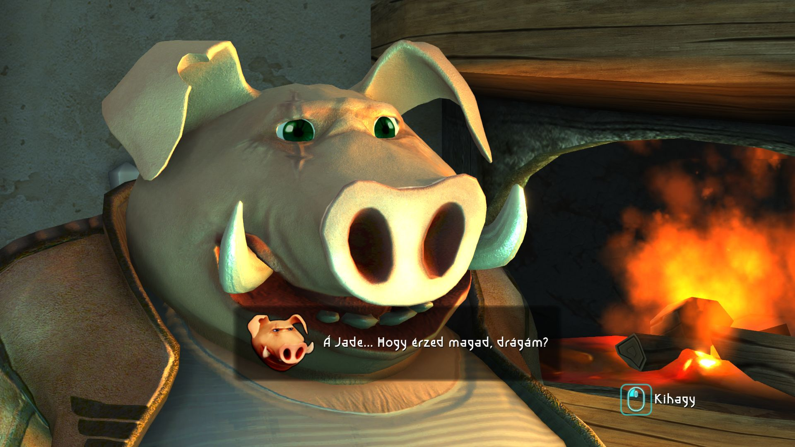
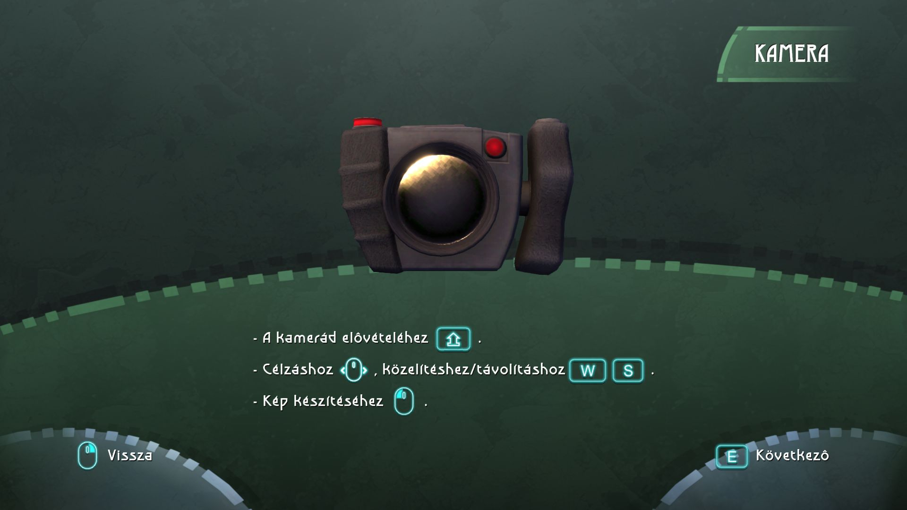

The tool can extract and repack **Beyond Good & Evil - 20th Anniversary Edition** game text PAK files. Not compatible with the original game.
The tool is compatible with the PC, PS4, NSW and probably with all platform version, but only the mentioned was tested!

>This is a commandline tool, no graphical interface!
>This is NOT a container tool, this is not able to unpack/repack any pak files from the game, only the text ones! No plan to extend the feature of the tool.
>
>Do not know where are the font files, and I am not plan to solve this mystery. If your accents are not visible in the game after the repack, the game is not supporting it.
>
>The tool has nothing to do with the developer or publisher of the game (not provided any support or code), the codebase developed by me!

[.NET Desktop Runtime 8](https://dotnet.microsoft.com/en-us/download/dotnet/8.0) is required to run the tool.



---
**Usage**

<ins>Unpack</ins>

To unpack language pak files just drag&drop pak file onto the tool exe file or you can provide the file as one and only argument. The unpacked files will be created in a new folder (foldername is the name of the original .pak file!).
The unpacked files has no proper names, these are hash names. Do not change them or the repack process create corrupted .pak file.
```
BGE20.exe Text-en_US.pak
```

<ins>Repack</ins>

To repack just drag&drop the original pak file, and if the unpacked folder is existng, the tool will repack from the content of the folder.
Recommended for repacking to drag&drop the unpacked folder onto the tool exe file.
To repack, only the unpacked folder neccessary with the modified txt files, the tool will recreate the pak files based on the txt files and based on the txt file names, so DO NOT change the name of the txt files.
```
BGE20.exe Text-en_US
```

---
**Need to know**

Some txt starts with ```[[Reversed]]``` string. DO NOT modify, change or remove them. These are neccessary part of the recalculation during the repack process. If you modify them the pak file will be corrupted.

Characters added to the texts by the tool; you can move, remove, add them anywhere, anytime, the tool will convert them back to the proper format for the game during the repack process:
- ```¤``` - \r = CR (Carriage Return) 
- ```|``` - \n = LF (Line Feed)
- ```¤|``` - \r\n = CR + LF

---

**Screenshots**



